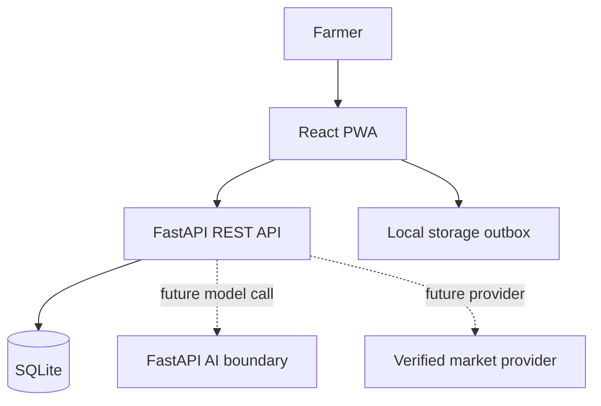

# Architecture

The backend is intentionally modular and small for a hackathon: API route -> persistence/service logic -> SQLite. The AI boundary can later host a MobileNet, EfficientNet, or validated agricultural YOLO pipeline without changing the farmer-facing contract.
